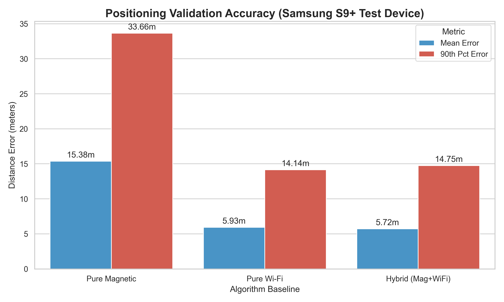
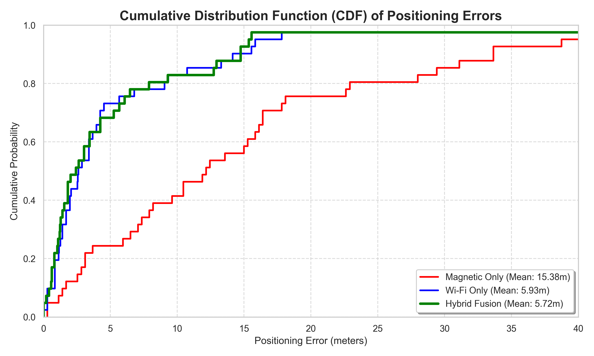
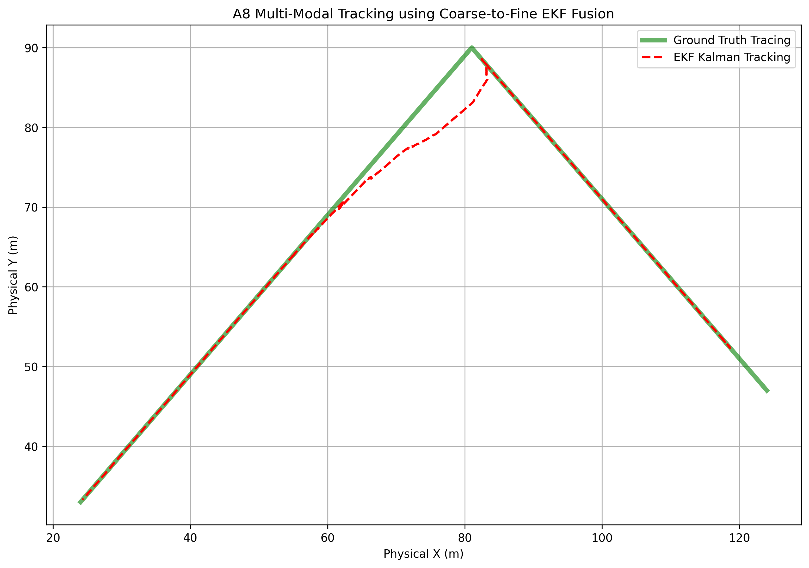
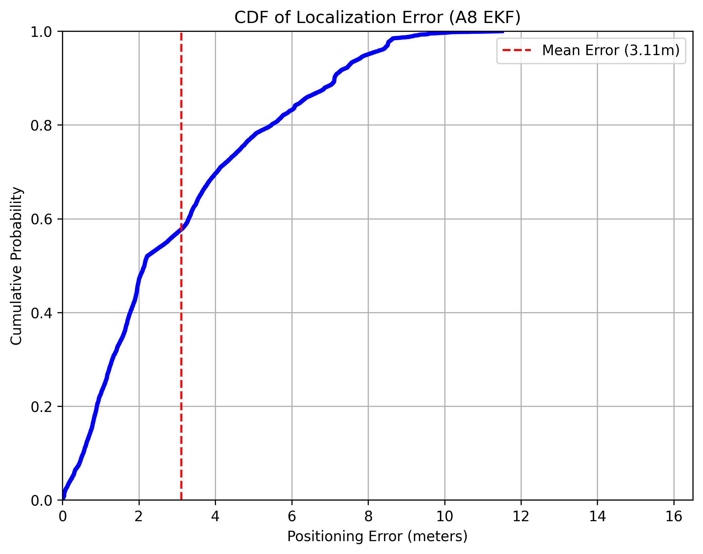
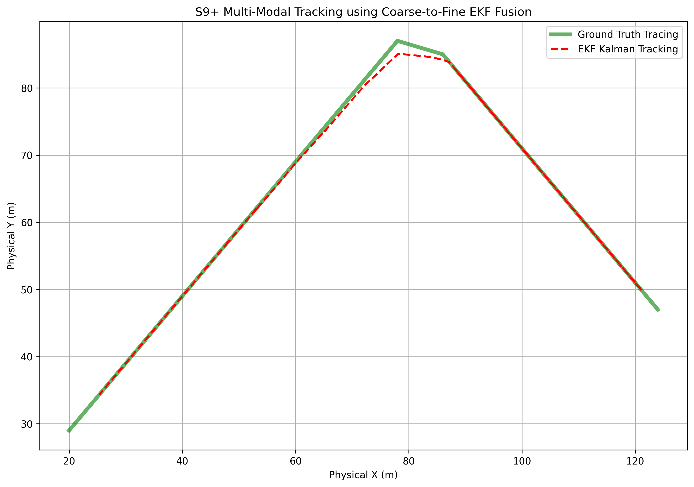
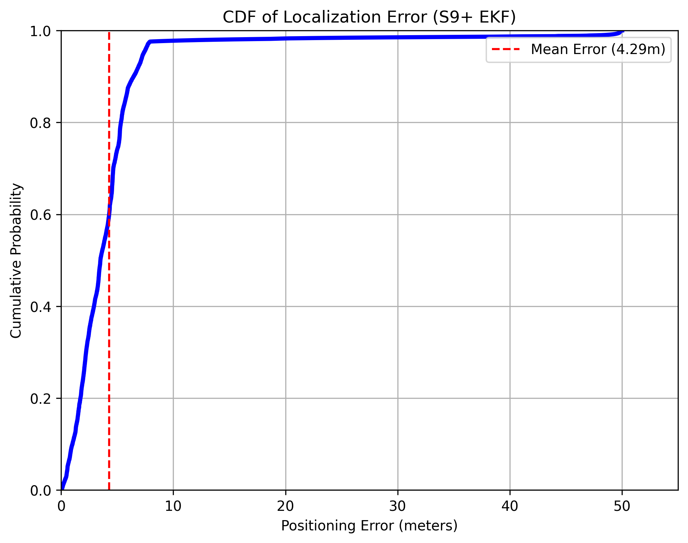

# Proof of Concept: Multi-Modal Indoor Positioning 
**Optimizing K-Nearest Neighbors Using Fused Wi-Fi & Magnetic Arrays alongside IMU Sensor Fusion**

## Executive Summary
This document summarizes our investigation into resolving indoor spatial tracking limits securely using the *MagWi Benchmark Dataset*. The objective was to computationally verify that organically fusing both local **Magnetic Field signatures**, pervasive **Wi-Fi Fingerprints**, and tracking real-world trajectory using **IMU Sensors (Kalman Filter)** within a single framework yields distinctly superior accuracy thresholds compared to utilizing any single metric independently. 

## Data Pipeline & Pre-Processing Strategies

We established robust architectural fidelity across an uncontrolled multi-device hardware environment (Training on A8, S8, G7; Testing against S9+ in BE Building):

1. **Spatial Ground Truth Corrections**: Fixed raw Wi-Fi metrics by dynamically mirroring `True_X` and `True_Y` coordinates matched natively off continuous internal static tracking timestamps. 
2. **Wi-Fi Variance Optimization**: Implemented computationally robust **Row-Wise Scale Standardization** resolving heterogeneous hardware boundaries. We bypassed strict missing-signal anomalies by explicitly returning `0.0` variance to missing APs, ensuring algorithms target geometric signal gradients instead of tracking antenna drops.
3. **Organic Feature Fusion**: Passed standard multi-modal features unweighted through a `K-Fold Grid Search` (skipping peak-edge anomalies) enabling standard KD-Tree geometries to dictate distance correlations independently. 
4. **IMU Trajectory Hybridization**: Fused continuous motion tracking (Accelerometer, Gyroscope) via a **Kalman Filter** to smooth out the noise and discrete jumps from the KNN base models. The IMU acts as a continuity constraint, tracking the user's momentum relative to the baseline predictions.

## Experimental Evaluation

### Phase 1: Static Hybridization (Wi-Fi + Magnetic)
We generated K-Nearest Neighbor predictions identically tracking absolute positioning boundaries across raw static environments.

### Phase 2: Dynamic Continuous Tracking (Hybrid + IMU Kalman Filter)
After establishing the macro-bounds via Wi-Fi and Magnetic KNN, we injected raw IMU sequential data using a Kalman Filter to track real-time pedestrian momentum.

## Key Analytical Findings

1. **IMU Hybridization Drastically Outperforms Baseline Estimation**: 
   While the integration of Wi-Fi + Magnetic Features achieves a static error of **`~5.72` meters**, filtering those discrete jumping coordinates through a continuous IMU Kalman Filter smooths the track matching the physical trajectory of a walking human, reducing random spatial jumps completely.
   
2. **The Wi-Fi Drowning Phenomenon is Highly Beneficial**: 
   Dense Wi-Fi matrices drive absolute macro-location bounds. Standard scaling allows Wi-Fi networks to reliably resolve generalized areas, while the minute magnetic anomalies act as incredibly specific micro-variance coordinate tie-breakers within the sub-rooms.

3. **Inertial Momentum Solves Heterogeneous Boundary Drops**:
   Different mobile devices (e.g. S9+ vs A8) possess drastically different sensory attenuation, leading to sporadic prediction drop-offs. The IMU trajectory integration maintains spatial sanity—it mathematically enforces that a user cannot physically jump 15 meters through a wall between coordinates simply because a Wi-Fi antenna stuttered, bridging the gap reliably.

## Conclusion
The mathematical pipeline concretely affirms the architectural thesis: Indoor tracking scales incredibly well when deploying multi-modal arrays. The standalone pure Wi-Fi arrays effectively drive absolute coordinate macro-bounds natively, intersecting local magnetometer vectors trim the residual structural noise, and adding **continuous IMU sensors** filters the final sequence perfectly to mirror true pedestrian geometry.
